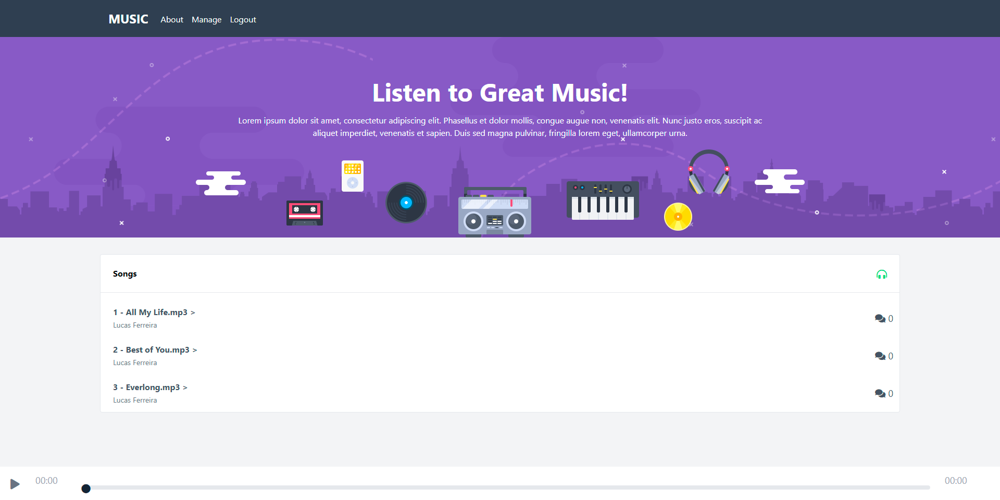
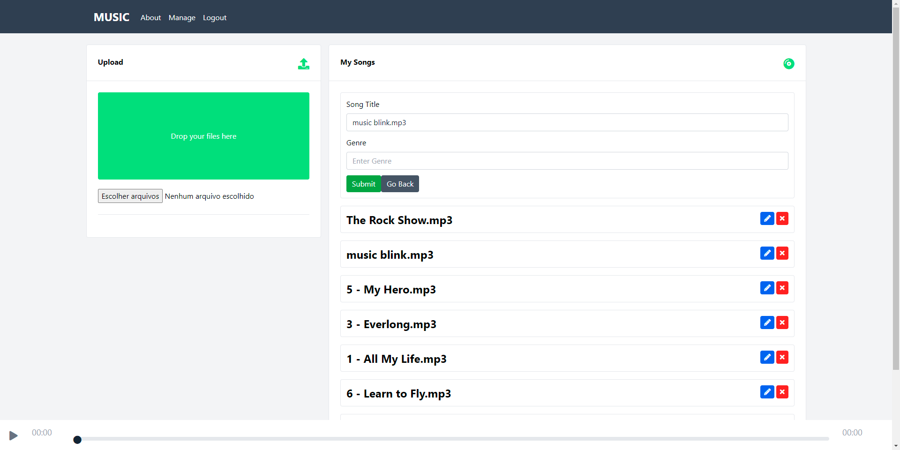

<!-- # projeto-3-musicapp -->
<h1 style="text-align: center; font-weight: bold;">Exercício MusicApp vue</h1>

## Preview 📸
<div align="center" style="display:flex; justify-content: space-between; margin:0 auto;" >
  
  
</div>

## Sobre o Projeto
Exercício com VueJs desenvolvido durante curso [Complete Vue Mastery 2022](https://www.udemy.com/course/complete-vue-js-developer-zero-to-mastery-vuex/) onde exploramos criação de componentes, gerência de estado, rotas, autenticação com mensagens de erro, conexão/configuração com Firebase e upload de arquivos.
A aplicação também permite executar as músicas salvas, adicionar comentários e editar ou excluir. Ótima exercício para quem está começando no ambiente Vue.

### 🛠 Tecnologias
As seguintes ferramentas foram usadas na construção do projeto:

- [Vue](https://vuejs.org/)
- [Firebase](https://firebase.google.com/)

Você precisará de uma conta no [Firebase](https://firebase.google.com/) e configurar o arquivo firebase.js com suas chaves

### 🎲 Rodando o projeto

```bash
# Instale as dependências
$ yarn install
# ou
$ npm install

# Execute a aplicação
$ yarn serve
# ou
$ npm run serve
```